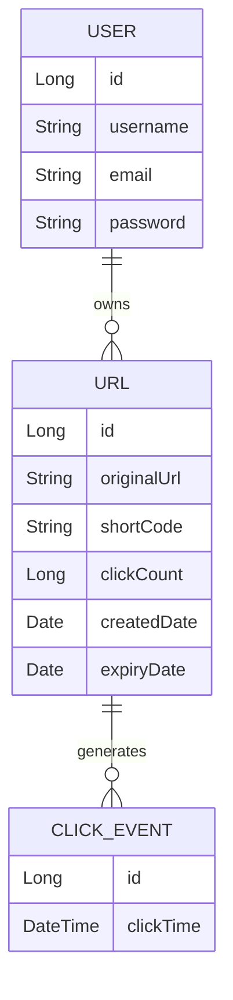

# 🔗 GoShortly

<div align="center">

**A production-ready URL Shortener built with React, Spring Boot, PostgreSQL & Redis**

Create short links, generate QR codes, track analytics, and manage URLs through a secure dashboard.


</div>

---

# 📖 Overview

GoShortly is a modern URL shortening platform designed with a production-style architecture.
It provides secure authentication, URL shortening, QR code generation, analytics dashboards,
Redis caching, and a responsive React interface.

---

# ✨ Features

## 🔐 Authentication
- JWT Authentication
- Spring Security
- Email Verification
- Protected APIs
- Role-based Authorization

## 🔗 URL Management
- Create Short URLs
- Delete URLs
- Copy Short URL
- QR Code Generation
- URL Expiration Support (optional)

## 📊 Analytics
- Total Clicks
- Click Timeline
- Dashboard Charts
- URL Analytics
- Daily Statistics

## 💻 Dashboard
- Analytics Cards
- Active URLs
- Search
- Pagination
- Responsive Design

---

# 🏗️ System Architecture

```text
                    React + Vite
                         │
                    Axios REST API
                         │
                Spring Boot Backend
                         │
             Spring Security + JWT
                         │
        ┌────────────────┴────────────────┐
        │                                 │
        ▼                                 ▼
    Redis Cache                     PostgreSQL
        │                                 │
        └──────────────┬──────────────────┘
                       ▼
                 URL Analytics
```

---

# ⚙️ Tech Stack

| Category | Technologies |
|----------|--------------|
| Frontend | React, Vite, Tailwind CSS, Material UI, Axios, React Router |
| Backend | Java 21, Spring Boot, Spring Security, Spring Data JPA, Hibernate |
| Database | PostgreSQL |
| Cache | Redis |
| Authentication | JWT |
| Charts | Recharts |
| Deployment | Render |
| Tools | Git, GitHub, Postman, VS Code, IntelliJ IDEA |

---

# 📂 Project Structure

```text
GoShortly
│
├── frontend
│   ├── components
│   ├── pages
│   ├── hooks
│   ├── context
│   ├── services
│   └── utils
│
├── backend
│   ├── controller
│   ├── service
│   ├── repository
│   ├── entity
│   ├── dto
│   ├── security
│   ├── config
│   └── exception
│
├── docs
├── screenshots
└── README.md
```

---

# 🔄 Request Flow

```text
Browser
   │
React
   │
Axios
   │
JWT Filter
   │
Controller
   │
Service
   │
Redis Cache
   │
Repository
   │
PostgreSQL
```

---

# ⚡ Redirect Flow

```text
User Clicks Short URL
        │
        ▼
Extract Short Code
        │
        ▼
Check Redis Cache
   │
   ├── Cache Hit → Redirect
   │
   └── Cache Miss
          │
          ▼
   Fetch from PostgreSQL
          │
 Increment Click Count
          │
 Update Redis Cache
          │
      Redirect User
```

---

# 📊 Analytics Flow

```text
Redirect Request
      │
      ▼
Increment Click Count
      │
Create Click Event
      │
Store in Database
      │
Dashboard Charts
```

---

# 🗄️ Database Design



---

# 🚀 Getting Started

```bash
git clone https://github.com/<your-username>/GoShortly.git
```

## Backend

```bash
cd backend
./mvnw spring-boot:run
```

## Frontend

```bash
cd frontend
npm install
npm run dev
```

---

# ⚙️ Environment Variables

## Backend

```properties
POSTGRES_URL=
POSTGRES_USERNAME=
POSTGRES_PASSWORD=

JWT_SECRET=
JWT_EXPIRATION=

REDIS_HOST=
REDIS_PORT=

FRONTEND_URL=
BACKEND_URL=
```

## Frontend

```env
VITE_API_URL=
```

---

# 📸 Screenshots

```
screenshots/
├── login.png
├── dashboard.png
├── create-url.png
├── analytics.png
├── qr-code.png
└── active-urls.png
```

---

# 🚀 Highlights

- Production-style Layered Architecture
- JWT Authentication
- Redis Caching
- PostgreSQL Persistence
- QR Code Generation
- Analytics Dashboard
- Responsive UI
- Pagination & Search
- Cloud Deployment (Render)

---

# 🔮 Future Enhancements

- Custom Domains
- Password Protected Links
- Kafka-based Click Processing
- Docker & Docker Compose
- Kubernetes
- Prometheus & Grafana
- Rate Limiting
- URL Tags
- Team Workspaces

---

# 🤝 Contributing

Contributions, issues, and feature requests are welcome. Feel free to fork the repository and submit a pull request.

---

# 📄 License

This project is licensed under the MIT License.

---

# 👨‍💻 Author

**Dev Dhama**

- GitHub: https://github.com/<your-username>
- LinkedIn: https://linkedin.com/in/dev-dhama
- Portfolio: https://<your-portfolio>

---

<div align="center">

⭐ If you like this project, consider giving it a Star!

</div>
